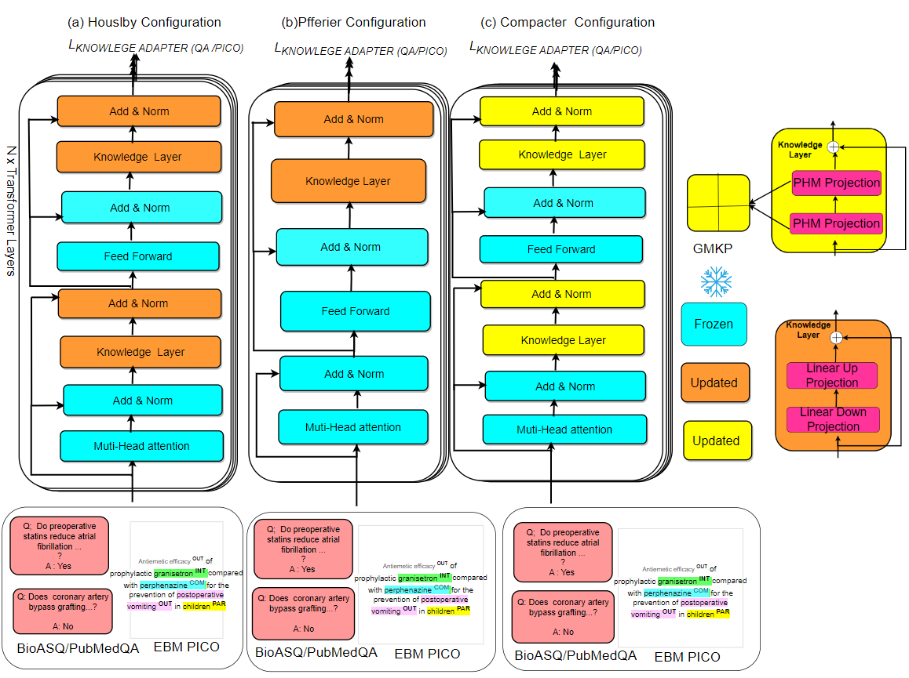
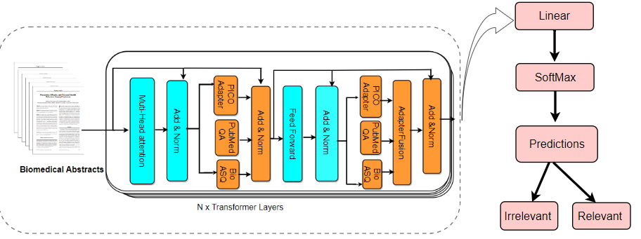

# Domain-Knowledge-into-PLMs-for-EBM (Accepted into AIME 2024 Main Conference)

### Table of Contents
- [Abstract](#features)
- [Methodology](#installation)
- [Prerequisites](#usage)
- [SR Train/Test Dataset](#visualizing-attacks)
- [Models](#generating-adversarial-images)
- [Limitation](#limitation)


### Abstract

Evidence-based medicine (EBM) represents a cornerstone in medical research, guiding policy and decision-making. However, the robust steps involved in EBM, particularly in the abstract screening stage, present significant challenges to researchers. Numerous attempts to automate this stage with pre-trained language models (PLMs) are often hindered by domain-specificity, particularly in EBMs involving animals and humans. Thus, this research introduces a state-of-the-art (SOTA) transfer learning approach to enhance abstract screening by incorporating domain knowledge into PLMs without altering their base weights. This is achieved by integrating small neural networks, referred to as knowledge layers, within the PLM architecture. These knowledge layers are trained on key domain knowledge pertinent to EBM, PICO entities, PubmedQA, and the BioASQ 7B biomedical Q\&A benchmark datasets. Furthermore, the study explores a fusion method to combine these trained knowledge layers, thereby leveraging multiple domain knowledge sources. Evaluation of the proposed method on four highly imbalanced EBM abstract screening datasets demonstrates its effectiveness in accelerating the screening process and surpassing the performance of strong baseline PLMs.


For more details, please check the latest version of the paper


### Methodology 

- Training of the knowledge domain adapters



- During Evaluation the knowledge domain adapters



###  Prerequisites
``` bash
- Python 3.6
- sklearn
- spacy
- torch
- transformers
```

### Spanish SR Train/Test Dataset

- The proposed model underwent finetuning and evaluation on ten complex medical SLR
abstract datasets encompassing both human and animal studies. These are the Aceves-Martins 2022, Aceves-Martins 2021 data,Muthu 2022,Van Dis, Wassenaar 2017, Menon 2022, Leenars 2019, Oud 2018, and Nelson 2006—are publicly available on the a modified [GitHub](https://github.com/asreview/synergy-dataset)

| **Dataset**                | **Research Focus**                                                                  | **Papers retrieved** | **Total Papers** | **Total Included** | **Included papers** |
|----------------------------|----------------------------------------------------------------------------------------|----------------------|------------------|--------------------|---------------------|
| Aceves-Martins 2021 (AM 21) | Oral Health and obesity in children                                                   | 807                  | 807              | 18                 | 18                  |
| Aceves-Martins 2022 (AM 22) | Nutritional status of prisoners                                                       | 13022                | 13022            | 69                 | 69                  |
| Appenzeller-Herzog 2019 (AH) | Therapy for Wilson Disease                                                            | 2873                 | 2873             | 29                 | 29                  |
| Leenars 2019 (LN)          | Animal to human translation                                                            | 5812                 | 5812             | 17                 | 17                  |
| Menon 2022 (MN)            | Toxicology and environmental epidemiology                                              | 975                  | 975              | 74                 | 74                  |
| Muthu 2021 (MU)            | Flexible bronchoscopy                                                                  | 2719                 | 2719             | 336                | 336                 |
| Nelson 2002 (NN)           | Diabetic foot ulcers                                                                   | 366                  | 366              | 80                 | 80                  |
| Oud 2018 (OH)              | Specialised psychotherapies for adults                                                 | 952                  | 952              | 20                 | 20                  |
| Van Dis 2020 (VD)          | Cognitive Behavioral Therapy                                                           | 9128                 | 9128             | 72                 | 72                  |


